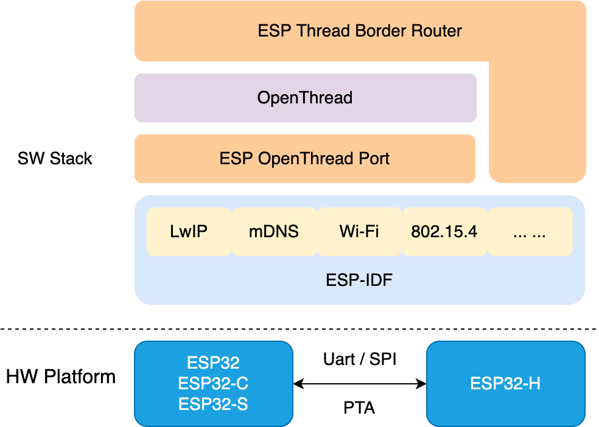
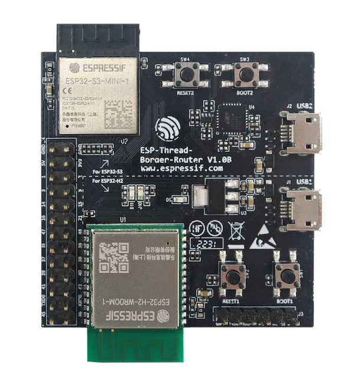
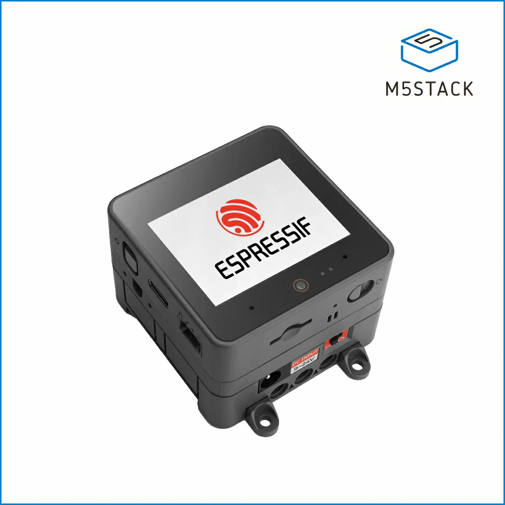

# ESP Thread Border Router SDK

ESP-THREAD-BR is the official Espressif Thread Border Router SDK. It supports all fundamental network features to build a [Thread Border Router](https://openthread.io/guides/border-router) (BR) and integrates rich product level features for quick productization.

# Software Components

The SDK is built on top of [ESP-IDF](https://github.com/espressif/esp-idf) and [OpenThread](https://github.com/openthread/openthread). The BR implementation is provided as pre-built library in ESP-IDF.

# Hardware Platforms

The hardware required for a Thread BR comprises two separate SoCs:

* An ESP32 series SoC (ESP32, ESP32-C, ESP32-S, etc) loaded with ESP Thread BR and OpenThread Stack.
* An ESP32-H 802.15.4 SoC loaded with OpenThread RCP.

## ESP Thread Border Router Board

The [ESP Thread Border Router](https://docs.espressif.com/projects/esp-thread-br/en/latest/hardware_platforms.html) board provides an integrated module of an ESP32-S3 SoC and an ESP32-H2 RCP. A Sub-Ethernet daughter board is available if an Ethernet-based Border Router is required.

The two SoCs are connected with following interfaces:
* UART and SPI for serial communication
* RESET and BOOT pins for RCP Update
* 3-Wires PTA for RF coexistence

This board is used as the default configuration for the [Basic Thread Border Router example](examples/basic_thread_border_router).

## M5Stack Thread Border Router

The [M5Stack Thread Border Router](https://shop.m5stack.com/products/m5stack-thread-border-router) is a ready-to-use Thread Border Router solution built with the [M5Stack CoreS3](https://shop.m5stack.com/products/m5stack-cores3-esp32s3-lotdevelopment-kit) (ESP32-S3) and the [ESP32-H2 Thread/Zigbee Gateway Module](https://shop.m5stack.com/products/esp32-h2-thread-zigbee-gateway-module).

Key features of the M5Stack Thread Border Router:
* **Touchscreen Interface**: The M5Stack CoreS3's built-in touchscreen enables intuitive interaction for Thread network management and credential sharing.
* **Credential Sharing**: Supports the Thread 1.4 Credential Sharing feature, allowing secure retrieval and configuration of Thread network credentials via an ephemeral key (ePSKc).
* **Wi-Fi Configuration**: On first boot, the device starts in SoftAP mode, providing a web-based Wi-Fi configuration interface.

This board is used as the default configuration for the [M5Stack Thread Border Router example](examples/m5stack_thread_border_router).

### Standalone Modules

The SDK also supports manually connecting an IEEE802.15.4-capable DevKit (e.g. ESP32-H2) RCP to an ESP32 series DevKit. Communication between RCP and SoC can be achieved using either one out of two supported serial communication protocols: UART or SPI. Please refer to the [Standalone RCP Guide](examples/basic_thread_border_router/README_standalone_RCP.md) for detailed wiring instructions. Specific instructions for the ESP32-P4 can be found [here](examples/basic_thread_border_router/README_esp32p4.md).

Recommended main processor and RCP combinations:

| Main Processor                                                    | RCP      | Use Case                                              |
|-------------------------------------------------------------------|----------|-------------------------------------------------------|
| [ESP32-P4](https://www.espressif.com/en/products/socs/esp32-p4)   | ESP32-C6 | High-performance applications with AI/ML capabilities |
| [ESP32-C5](https://www.espressif.com/en/products/socs/esp32-c5)   | ESP32-H2 | Dual-band Wi-Fi (2.4 GHz + 5 GHz) support             |
| [ESP32-C61](https://www.espressif.com/en/products/socs/esp32-c61) | ESP32-H2 | Wi-Fi 6 (802.11ax) support                            |
| [ESP32-S3](https://www.espressif.com/en/products/socs/esp32-s3)   | ESP32-H2 | General-purpose with display/camera support           |

For standalone modules, we recommend the [ot_br](https://github.com/espressif/esp-idf/tree/master/examples/openthread/ot_br) example in esp-idf as a quick start. For a more comprehensive set of features, the [Basic Thread Border Router example](examples/basic_thread_border_router) is also supported.

# Provided Features

These features are currently provided by the SDK:

* **Bi-directional IPv6 Connectivity**: The devices on the backbone link (typically Wi-Fi or Ethernet) and the Thread network can reach each other.
* **Service Discovery Delegate**: The devices on the Thread network can find the mDNS services on the backbone link.
* **Service Registration Server**: The devices on the Thread network can register services to the BR for devices on the backbone link to discover.
* **Multicast Forwarding**: The devices joining the same multicast group on the backbone link and the Thread network can be reached with one single multicast.
* **NAT64**: The devices can access the IPv4 Internet via the BR.
* **Credential Sharing**: The BR could safely share administrative access and allow extracting the network credentials of the network.
* **TREL**: It enables Thread devices to communicate directly over IPv6-based links other than IEEE 802.15.4, including Wi-Fi and Ethernet.
* **RCP Update**: The built BR image will contain an updatable RCP image and can automatically update the RCP on version mismatch or RCP failure.
* **Web GUI**: The BR will enable a web server and provide some practical functions including Thread network discovery, network formation, status query and topology monitor.
* **RF Coexistence**: The BR supports optional external coexistence, a feature that enhances the transmission performance when there are channel conflicts between the Wi-Fi and Thread networks.

# Resources

* Documentation for the latest version: https://docs.espressif.com/projects/esp-thread-br/. This documentation is built from the [docs directory](docs) of this repository.

* [Check the Issues section on github](https://github.com/espressif/esp-thread-br/issues) if you find a bug or have a feature request. Please check existing Issues before opening a new one.

* If you're interested in contributing to ESP-THREAD-BR, please check the [Contributions Guide](https://docs.espressif.com/projects/esp-idf/en/latest/contribute/index.html).
