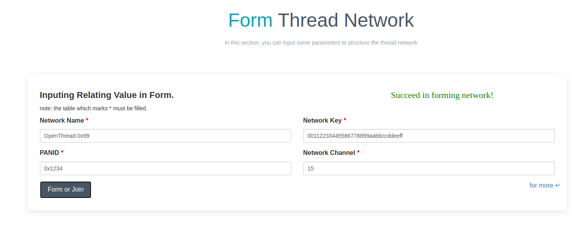
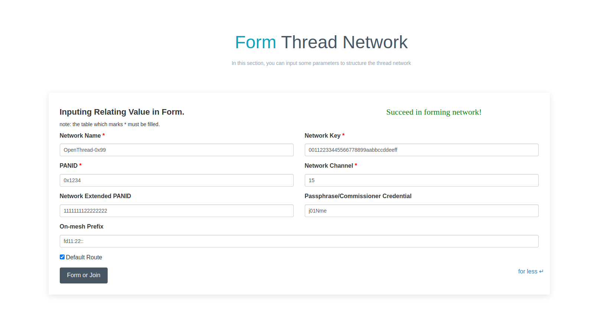

# OpenThread Border Router Web Server

## Overview

ESP openthread border router web server provides practical functions including Thread network discovery, network formation and status query.

## Configuration

Enable both `OPENTHREAD_BR_AUTO_START` and `OPENTHREAD_BR_START_SERVER` to enable the Web Server feature.

The website address will be shown in command line terminal:
```
OTBR_WEB: <=======================server start========================>

OTBR_WEB: http://192.168.201.187:80/index.html

OTBR_WEB: <===========================================================>

```

## Web Server Functionalities

### Discover
- By clicking the 'scan' button, you can scan for the available Thread networks.
The networks will be shown in the table with their network name, channel, extended panid, panid, Mac address, txpower and so on.


### Form
- You can form a Thread network in this section. First, you need to fill network's parameters in the following table. Then click the 'Form' button to submit the message. The server will validate the network information and form the network on success.

- The button 'for more' provides a way to form Thread network with some supplementary parameters.


- Notes: The label marked "*" must be filled.

### Status
- Thread network's running status will been shown in this section.

