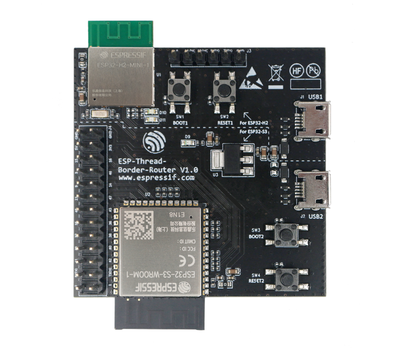

************************************************
1. Introduction to ESP Thread Border Router
************************************************

1.1. System Components
----------------------------

The ESP Thread Border Router is composed of two main components:

   - The host Wi-Fi SoC, which can be ESP32, ESP32-S and ESP32-C series SoC.
   - The radio co-processor (RCP), which is an ESP32-H series SoC. The RCP enables the Border Router to access the 802.15.4 physical and MAC layer.

Espressif also provides a Border Router devkit which integrates the host SoC and the RCP into one module.

   ESP-Thread-Border-Router DevKit

1.2. Key Features
------------------------

The ESP Thread Border Router solution provides the following features:

  - Bi-directional IPv6 connectivity to the Wi-Fi network.
  - Service discovery on the Wi-Fi network and the Thread network.
  - Multicast forwarding between the Wi-Fi and the Thread network.
  - Access to the IPv4 Internet (NAT64).
  - Updating the Border Router and the RCP from the cloud.

1.3. Web GUI
-------------------------

.. todo::
   Add introduction to Web GUI after implementing it.
