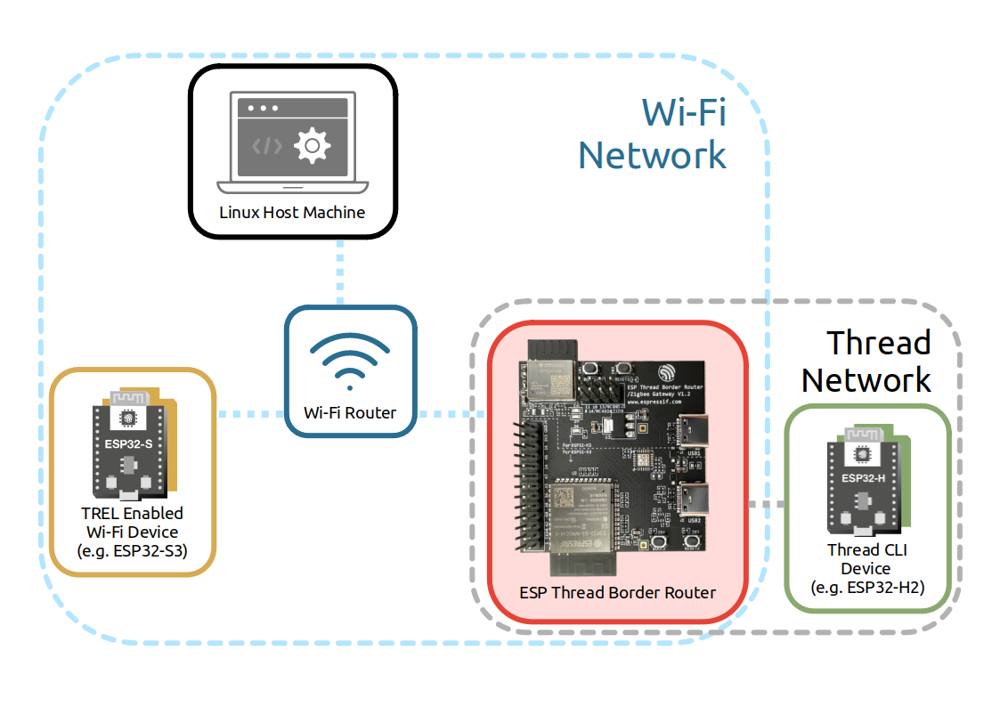

*****************************
3.0. Hardware / Network Setup
*****************************

To start running some of the examples available in this Codelab, the following requirements must be fulfilled: 

Hardware Requirements
---------------------

The table below shows the device requirements for each example in this codelab:

+-----------------------------------------------------------+-----------------------+--------+---------+---------------+
| Devices required for example:                             | 3.1, 3.2, and 3.3     | 3.4    | 3.5     | 3.6           |
+-----------------------------------------------------------+-----------------------+--------+---------+---------------+
|                                                           | Bi-directional IPv6   | NAT64  | Web GUI | Thread Radio  |
|                                                           |                       |        |         |               |
|                                                           | Connectivity,         |        |         | Encapsulation |
|                                                           |                       |        |         |               |
|                                                           | Multicast Forwarding, |        |         | Link (TREL)   |
|                                                           |                       |        |         |               |
|                                                           | Service Discovery     |        |         |               |
+===========================================================+=======================+========+=========+===============+
| ESP Thread Border Router (BR)                             | Yes                   | Yes    | Yes     | Yes           |
+-----------------------------------------------------------+-----------------------+--------+---------+---------------+
| Thread CLI device (e.g. ESP32-H2)                         | Yes                   | Yes    | \-      | Yes           |
+-----------------------------------------------------------+-----------------------+--------+---------+---------------+
| Linux Host Machine                                        | Yes                   | \-     | Yes     | \-            |
+-----------------------------------------------------------+-----------------------+--------+---------+---------------+
| TREL enabled Wi-Fi device (e.g. ESP32-S3)                 | \-                    | \-     | \-      | Yes           |
|                                                           |                       |        |         |               |
| *\* does not need to have built-in 802.15.4 capabilities* |                       |        |         |               |
+-----------------------------------------------------------+-----------------------+--------+---------+---------------+

In addition, access credentials for a 2.4GHz Wi-Fi network (SSID and password) are also required.

- Note: to run the ``curl http://www.espressif.com`` command in NAT64 example, this Wi-Fi network must be connected to the internet. 

Project Configurations
----------------------

The devices must be flashed with the appropriate examples available in esp-idf or esp-thread-br: 

- **ESP Thread Border Router** flashed with the `Thread BR Example <https://github.com/espressif/esp-thread-br/blob/main/examples/basic_thread_border_router/README.md>`_
- **Thread CLI device** flashed with the `Thread CLI Example <https://github.com/espressif/esp-idf/blob/master/examples/openthread/ot_cli/README.md>`_
- **TREL enabled Wi-Fi device** flashed with the `TREL Example <https://github.com/espressif/esp-idf/blob/master/examples/openthread/ot_trel/README.md>`_

Run ``idf.py menuconfig`` in each example directory to open a text-based configuration menu to configure the projects. The following projects should be configured accordingly before they are built:

The Thread BR should be configured to enable TREL feature, which can be found in:

.. code-block::

    idf.py menuconfig
        → Component config 
        → OpenThread 
        → OpenThread 
        → Thread Core Features 
        → Thread Trel Radio Link 
        → Enable Thread Radio Encapsulation Link (TREL)

Both the Thread BR and Wi-Fi device should be configured to join the same Wi-Fi network using:

.. code-block::

    idf.py menuconfig
        → Example Connection Configuration 
        → WiFi SSID
    idf.py menuconfig
        → Example Connection Configuration 
        → WiFi Password

If users do not wish to provide Wi-Fi credentials via menuconfig, the credentials may also be 
provided at runtime via:

.. code-block::

    > wifi connect -s <ssid> -p <psk>

Network Topology
----------------

In order to use the ESP Thread BR, two networks will be set up:

- Wi-Fi network (provided by Wi-Fi router)
- Thread network

   Thread / Wi-Fi Network Topology

*Note: while any FTD (full-thread device) can take on the role of LEADER in the Thread network, the ESP Thread BR will be used by default in this Codelab.*

ESP Thread BR join network
^^^^^^^^^^^^^^^^^^^^^^^^^^

1. Build and flash the Thread BR Example on the ESP Thread BR device, and wait a few moments for it to connect to the Wi-Fi network automatically (if configured in ``menuconfig``). 
2. Check that the ESP Thread BR device is connected to the Wi-Fi network:

.. code-block::

    > wifi state
    connected
    Done

3. Use the ESP Thread BR device to form a Thread network: 

.. code-block::

    > ifconfig up
    Done
    > thread start
    Done

4. Check that the ESP Thread BR device has assumed the role of LEADER in the Thread network:

.. code-block::

    > state
    leader
    Done

5. Obtain the Thread network details for use later:

.. code-block::

    > dataset active -x
    0e080000000000010000000300001835060004001fffe00208fe7bb701f5f1125d0708fd75cbde7c6647bd0510b3914792d44f45b6c7d76eb9306eec94030f4f70656e5468726561642d35383332010258320410e35c581af5029b054fc904a24c2b27700c0402a0fff8

Thread CLI device join network
^^^^^^^^^^^^^^^^^^^^^^^^^^^^^^

1. Build and flash the Thread CLI Example on the Thread CLI device. 
2. Set the Thread network details on the Thread CLI device, and wait a few moments for it to join the Thread network:

.. code-block::

    > dataset set active 0e080000000000010000000300001835060004001fffe00208fe7bb701f5f1125d0708fd75cbde7c6647bd0510b3914792d44f45b6c7d76eb9306eec94030f4f70656e5468726561642d35383332010258320410e35c581af5029b054fc904a24c2b27700c0402a0fff8
    > ifconfig up
    Done
    > thread start
    Done

3. Check that the Thread CLI device has joined the Thread network and assumed the role of ROUTER or CHILD:

.. code-block::

    > state
    router # child is also a valid state
    Done

TREL enabled Wi-Fi device join network
^^^^^^^^^^^^^^^^^^^^^^^^^^^^^^^^^^^^^^

1. Build and flash the TREL Example on the TREL enabled Wi-Fi device, and wait a few moments for it to connect to the Wi-Fi network automatically (if configured in ``menuconfig``). 
2. Check that the TREL enabled Wi-Fi device is connected to the Wi-Fi network:

.. code-block::

    > wifi state
    connected
    Done

3. Set the Thread network details on the TREL enabled Wi-Fi device, and wait a few moments for it to join the Thread network:

.. code-block::

    > dataset set active 0e080000000000010000000300001835060004001fffe00208fe7bb701f5f1125d0708fd75cbde7c6647bd0510b3914792d44f45b6c7d76eb9306eec94030f4f70656e5468726561642d35383332010258320410e35c581af5029b054fc904a24c2b27700c0402a0fff8
    > ifconfig up
    Done
    > thread start
    Done

4. Check that the Thread CLI device has joined the Thread network and assumed the role of ROUTER or CHILD:

.. code-block::

    > state
    router # child is also a valid state
    Done