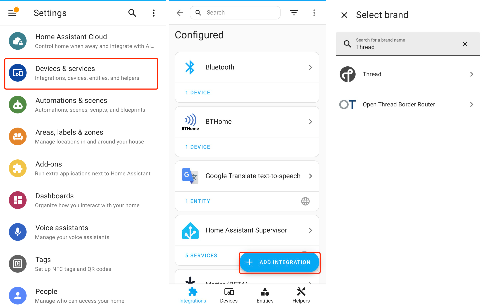
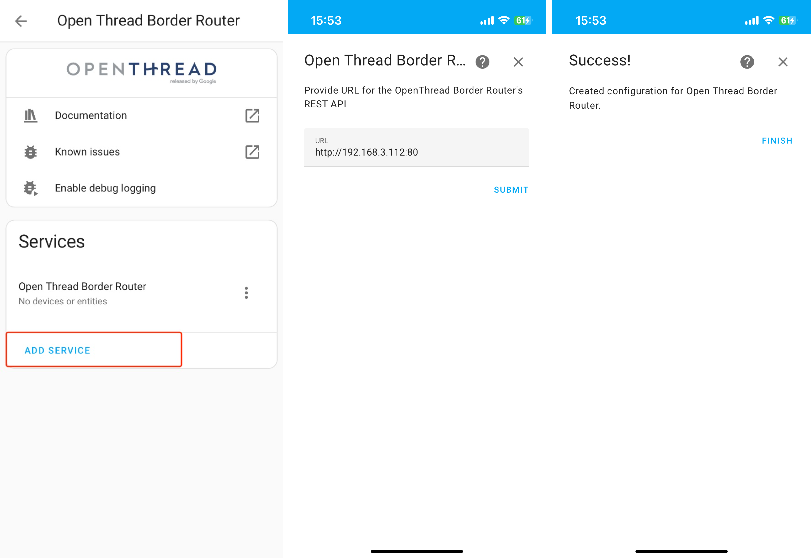

*******************************
3.7. Home Assistant Integration
*******************************

Home Assistant offers integration with `OpenThread Border Routers <https://www.home-assistant.io/integrations/thread/#openthread-border-routers>`_, which can be configured and controlled via REST APIs.

The Espressif Thread BR solution provides the same `REST APIs <https://docs.espressif.com/projects/esp-thread-br/en/latest/codelab/web-gui.html#thread-rest-apis>`_ as OpenThread Border Routers (based on ot-br-posix), making it compatible with Home Assistant.

Hardware Prerequisites
----------------------

- An ESP Thread Border Router
- A `Home Assistant Hub <https://www.home-assistant.io/installation/>`_
- A smartphone with the Home Assistant App installed

The ESP Thread BR firmware must have the ``CONFIG_OPENTHREAD_BR_START_WEB`` option enabled to activate the Web Server feature.

Ensure that the ESP Thread BR, Home Assistant Hub, and smartphone are connected to the same local network via Wi-Fi or Ethernet.

Add OpenThread Border Router Integration
----------------------------------------

In the Home Assistant App, navigate to ``Settings`` -> ``Devices & services`` -> ``ADD INTEGRATION``, then add the following integrations:

- OpenThread Border Router
- Thread

   Add Thread integrations

Once the ESP Thread BR successfully connects to Wi-Fi and starts a Web server, obtain it's IPv4 address from the log entries (as shown below):

.. code-block::

    I (5211) obtr_web: <=======================server start========================>

    I (5211) obtr_web: http://192.168.3.112:80/index.html

    I (5211) obtr_web: <===========================================================>

Go to the ``OpenThread Border Router`` integration, click ``ADD SERVICE``, then enter the IPv4 address of the Thread BR obtained earlier (with port number) in the ``URL`` field:

.. code-block::

    http://192.168.3.112:80

The Home Assistant App will communicate with the Thread BR using Rest APIs once the URL has been successfully configured.

   Add Thread BR service

Add Thread Integration
----------------------

Go to the ``Thread`` integration and click ``CONFIGURE``, and ensure that the ESP Thread BR has been selected as the preferred network.

Next, click ``Send Credentials to Home Assistant`` and ``Send Credentials To Phone``. Home Assistant will retrieve the Thread credentials from the BR and store them in the user's account.

The Thread BR integration is now complete. You can now add Thread-based devices, such as those using the Matter integration.

.. figure:: ../../images/HA_Thread_BR3.png
   :align: center
   :alt: Add Matter over Thread device
   :figclass: align-center

   Add Matter over Thread device
