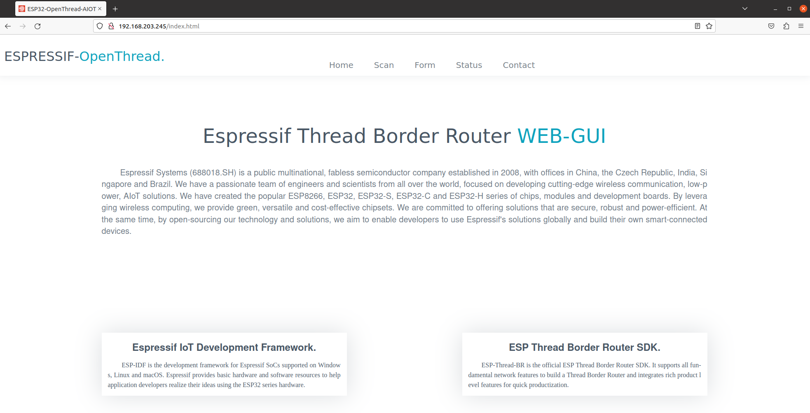
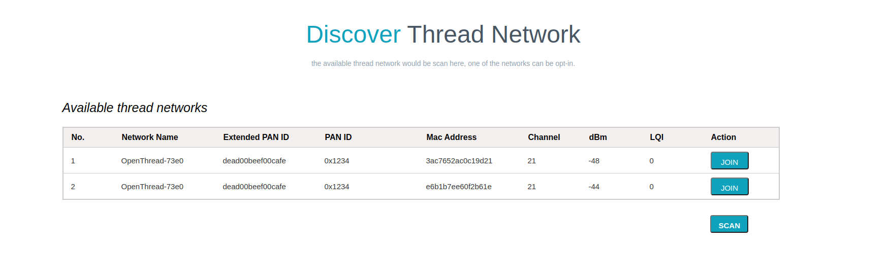
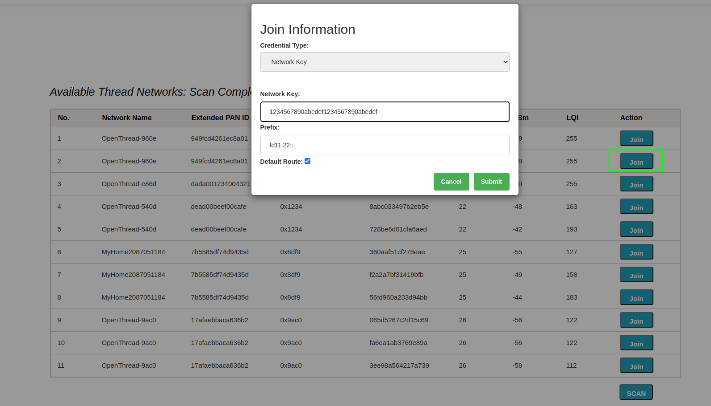
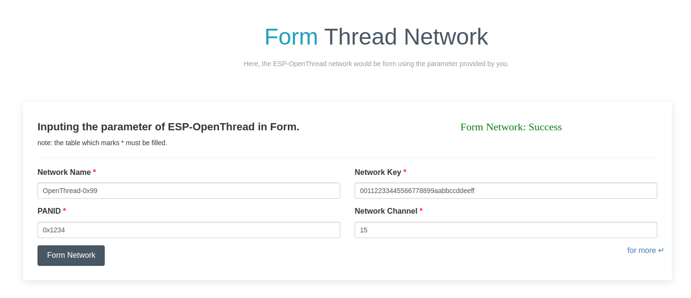
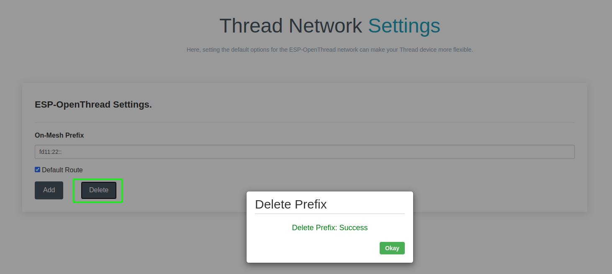
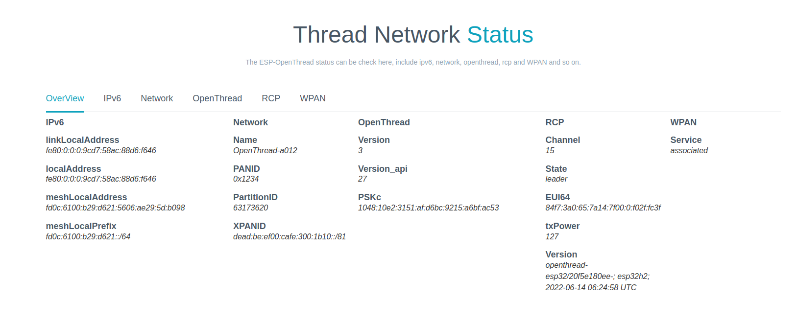
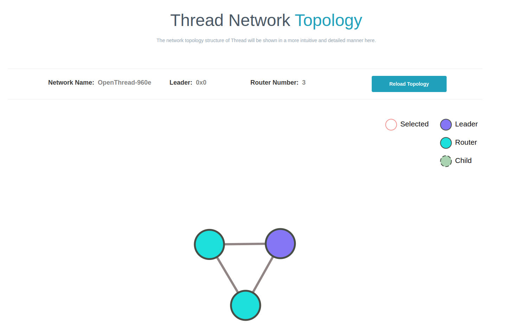

************
3.5. WEB GUI
************

The ESP Thread Border Router is equipped with a user-friendly graphical user interface (GUI) that enables users to easily discover, configure, and monitor Thread networks through the web server.

To access the Web GUI, simply enter ``the local IPv4 address`` for the ESP Thread Border Router in your browser window with port ``80`` and the path ``index.html``.

   ESP-Thread-Border-Router GUI

Prerequisites
-------------

To perform web gui, the follow device are required:

- An ESP Thread Border Router
- A Linux host machine with browser

Enable the ``CONFIG_OPENTHREAD_BR_START_WEB`` option to enable the Web Server feature.

The Thread Border Router and the Linux Host machine shall be connected to the same Wi-Fi network that has access to the Internet.

When the ESP Thread Border Router starts up, it will print the website's access address to terminal of the Linux host.

such as:

.. code-block::

    otbr_web: <=======================server start========================>

    otbr_web: http://192.168.200.98:80/index.html

    otbr_web: <===========================================================>

All REST APIs can be accessed by visiting the IPv4 address of the Thread-Border-Router-Board using the ``HTTP`` on port 80 with the API field specified.

Thread REST APIs
----------------

The ESP Thread Border Router server provides the REST APIs that are compatible with `ot-br-posix <https://github.com/openthread/ot-br-posix>`_

The Thread REST APIs field include ``/diagnostics``, ``/node``, ``/node/rloc``, ``/node/rloc16``, ``/node/ext-address``, ``/node/state``, ``/node/network-name``, ``/node/leader-data``, ``/node/num-of-router``, ``/node/ext-panid``, ``/node/ba-id``, ``/node/dataset/active`` and ``/node/dataset/pending``.

Visit `openapi.yaml <https://github.com/espressif/esp-thread-br/blob/main/components/esp_ot_br_server/src/openapi.yaml>`_ for more information about the ESP Thread REST APIs.

Entering this link to the browser of Linux machine:

.. code-block::

    http://192.168.200.98:80/node

The following feedback result will display on the browser:

.. code-block::

    {
        "NetworkName":	"OpenThread-4c68",
        "ExtPanId":	"f4f9437404558d34",
        "ExtAddress":	"caf97e6ee990b047",
        "RlocAddress":	"fd12:cb40:859f:287e:0:ff:fe00:3800",
        "LeaderData":	{
            "PartitionId":	61563841,
            "Weighting":	64,
            "DataVersion":	211,
            "StableDataVersion":	110,
            "LeaderRouterId":	14
        },
        "State":	4,
        "Rloc16":	14336,
        "NumOfRouter":	1
    }

The access method for other APIs is similar to the one described above.

Web GUI REST APIs
-------------------
The web server of ESP Thread Border Router provides the ``avaiable_network`` API to discover all the available Thread networks.

Entering this link to the browser of Linux machine:

.. code-block::

    http://192.168.200.98:80/available_network

The feedback result may appear as follows:

.. code-block::

    {
        "error":	0,
        "result":	[{
                "id":	1,
                "nn":	"OpenThread",
                "ep":	"dead00beef00cafe",
                "pi":	"0xa06d",
                "ha":	"5a1ee78f873814fc",
                "ch":	11,
                "ri":	-35,
                "li":	229
            }, {
                "id":	2,
                "nn":	"GRL",
                "ep":	"000db80000000000",
                "pi":	"0xfacf",
                "ha":	"166e0a0000000003",
                "ch":	17,
                "ri":	-70,
                "li":	51
            }, {
                "id":	3,
                "nn":	"NEST-PAN-3DDF",
                "ep":	"4500ddd4f9c1597d",
                "pi":	"0x3ddf",
                "ha":	"9e517ed148e81409",
                "ch":	20,
                "ri":	-39,
                "li":	209
            }],
        "message":	"Networks: Success"
    }

The web server of ESP Thread Border Router provides the ``get_properties`` API to check the Thread network status.

Entering this link to the browser of Linux machine:

.. code-block::

    http://192.168.200.98:80/get_properties

The feedback result may appear as follows:

.. code-block::
    
    {
        "error":	0,
        "result":	{
            "IPv6:LinkLocalAddress":	"fe80:0:0:0:c8f9:7e6e:e990:b047",
            "IPv6:RoutingLocalAddress":	"fd12:cb40:859f:287e:0:ff:fe00:3800",
            "IPv6:MeshLocalAddress":	"fd12:cb40:859f:287e:a8b5:c617:396b:a4c2",
            "IPv6:MeshLocalPrefix":	"fd12:cb40:859f:287e::/64",
            "Network:Name":	"OpenThread-4c68",
            "Network:PANID":	"0x1254",
            "Network:PartitionID":	"61563841",
            "Network:XPANID":	"f4f9437404558d34",
            "OpenThread:Version":	"openthread-esp32/f4446d8819-091f68ed7; esp32s3;  2023-05-05 13:05:02 UTC",
            "OpenThread:Version API":	"292",
            "RCP:State":	"leader",
            "OpenThread:PSKc":	"e66d93364793c33985280abb639c214c",
            "RCP:Channel":	"12",
            "RCP:EUI64":	"6055f9f72eebfeff",
            "RCP:TxPower":	"10 dBm",
            "RCP:Version":	"openthread-esp32/f4446d8819-091f68ed7; esp32h2;  2023-05-04 08:35:37 UTC",
            "WPAN service":	"associated"
        },
        "message":	"Properties: Success"
    }

The web server of ESP Thread Border Router provides the ``node_information`` API to obtain the Thread node information.

Entering this link to the browser of Linux machine:

.. code-block::

    http://192.168.200.98:80/node_information

The feedback result may appear as follows:

.. code-block::

    {
        "error":	0,
        "result":	{
            "NetworkName":	"OpenThread-4c68",
            "ExtPanId":	"f4f9437404558d34",
            "ExtAddress":	"caf97e6ee990b047",
            "RlocAddress":	"fd12:cb40:859f:287e:0:ff:fe00:3800",
            "LeaderData":	{
                "PartitionId":	61563841,
                "Weighting":	64,
                "DataVersion":	225,
                "StableDataVersion":	124,
                "LeaderRouterId":	14
            },
            "State":	4,
            "Rloc16":	14336,
            "NumOfRouter":	1
        },
        "message":	"Get Node: Success"
    }

The web server of ESP Thread Border Router provides the ``topology`` API to retrieve information about the relationship between Thread networks.

Entering this link to the browser of a Linux machine:

.. code-block::

    http://192.168.200.98:80/topology

The feedback result may appear as follows:

.. code-block::

    {
	    "error":	0,
        "result":	[{
                "ExtAddress":	"caf97e6ee990b047",
                "Rloc16":	14336,
                "Mode":	{
                    "RxOnWhenIdle":	1,
                    "DeviceType":	1,
                    "NetworkData":	1
                },
                "Connectivity":	{
                    "ParentPriority":	0,
                    "LinkQuality3":	0,
                    "LinkQuality2":	0,
                    "LinkQuality1":	0,
                    "LeaderCost":	0,
                    "IdSequence":	131,
                    "ActiveRouters":	1,
                    "SedBufferSize":	1280,
                    "SedDatagramCount":	1
                },
                "Route":	{
                    "IdSequence":	131,
                    "RouteData":	[{
                            "RouteId":	14,
                            "LinkQualityOut":	0,
                            "LinkQualityIn":	0,
                            "RouteCost":	1
                        }]
                },
                "LeaderData":	{
                    "PartitionId":	61563841,
                    "Weighting":	64,
                    "DataVersion":	229,
                    "StableDataVersion":	128,
                    "LeaderRouterId":	14
                },
                "NetworkData":	"08040b02cca60b0e8001010d09380000000500000e1003140040fd634dc9496e000105043800f10007021140030f0040fdf4f94374048d3401033800000b1981015d0d143800fd12cb40859f287ea8b5c617396ba4c2d11f03130060fd634dc9496e00020000000001033800e0",
                "IP6AddressList":	[
                                    "fd12:cb40:859f:287e:0:ff:fe00:fc11", 
                                    "fd63:4dc9:496e:1:9967:1ba3:5fbf:f2e6", 
                                    "fd12:cb40:859f:287e:0:ff:fe00:fc10", 
                                    "fd12:cb40:859f:287e:0:ff:fe00:fc38", 
                                    "fd12:cb40:859f:287e:0:ff:fe00:fc00", 
                                    "fd12:cb40:859f:287e:0:ff:fe00:3800", 
                                    "fd12:cb40:859f:287e:a8b5:c617:396b:a4c2", 
                                    "fe80:0:0:0:c8f9:7e6e:e990:b047"
                                    ],
                "MACCounters":	{
                    "IfInUnknownProtos":	0,
                    "IfInErrors":	0,
                    "IfOutErrors":	0,
                    "IfInUcastPkts":	13,
                    "IfInBroadcastPkts":	56,
                    "IfInDiscards":	0,
                    "IfOutUcastPkts":	0,
                    "IfOutBroadcastPkts":	201,
                    "IfOutDiscards":	0
                },
                "ChildTable":	[],
                "ChannelPages":	"00"
            }],
        "message":	"Topology: Success"
    }

The web server provides a ``HTTP_POST`` entry that allows users to configure the Border Router to use either ``networkKeyType`` or ``pskdType`` for joining other networks.

The JSON format of ``join_network`` API appears as follow:

.. code-block::

    { 
        "credentialType":   "networkKeyType", 
        "networkKey"    :   "00112233445566778899aabbccddeeff", 
        "pskd"          :   "12345678", 
        "prefix"        :   "fd11:22::", 
        "defaultRoute"  :   1, 
        "index"         :   1 
    }

Note that the network to be joined MUST be the networks scanned by the ``available_network`` API, the ``index`` indicates the sequence of available networks.

The web server provides a ``HTTP_POST`` entry that allows users to configure the Border Router to use the parameter provided by user for forming a Thread network.

The JSON format of ``form_network`` API appears as follow:

.. code-block::

    {                                                                      
        "networkName"   :   "OpenThread-0x99",                             
        "networkKey"    :   "00112233445566778899aabbccddeeff",            
        "panId"         :   "0x1234",                                      
        "channel"       :   16,                                            
        "extPanId"      :   "1111111122222222",                            
        "passphrase"    :   "j01Nme",                                      
        "prefix"        :   "fd11:22::",                                   
        "defaultRoute"  :   1                                              
    }

The web server provides a ``HTTP_POST`` entry that allows users to configure the Border Router for setting current Thread network.

The JSON format of ``add_prefix`` API appears as follow:

.. code-block::

    { 
        "prefix":       "fd11:22::", 
        "defaultRoute":  1 
    } 

The JSON format of ``delete_prefix`` API appears as follow:

.. code-block::

    { 
        "prefix":       "fd11:22::", 
    }

Web GUI Application Introduction
---------------------------------
ESP Thread Border Router Web GUI provides practical functions including Thread network discovery, network formation, network settings, status query and network.

Discover
^^^^^^^^^
By clicking the ``scan`` button, you can discover for the available Thread networks.
The networks will be shown in the table with their network name, channel, extended panid, panid, Mac address, txpower and so on.

Join
^^^^^
You can select an available network to join by clicking the ``join`` button.
Enter the relevant information into the pop-up dialog, submit it, and the result will be displayed for you after a moment.

Form
^^^^^
You can form a Thread network in this section. First, you need to fill network's parameters in the following table. Then click the ``Form Network`` button to submit the message. The server will validate the network information and form the network on success.

Settings
^^^^^^^^^
The IPv6 network prefix for Thread can be set in the Settings section. To add it, click ``Add``, and to delete it, click ``Delete``.

Status
^^^^^^^
By clicking the ``OverView`` bar, the properties of Thread network will been displayed in the corresponding section.

Topology
^^^^^^^^^
By clicking the ``Start Topology`` button, the topology of the current Thread node will be intuitively drawn and displayed.

