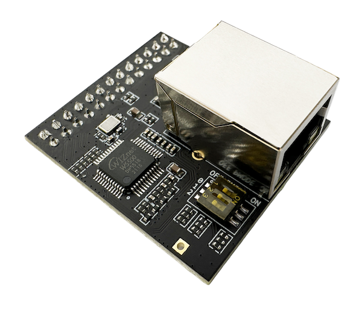

*********************
1. Hardware Platforms
*********************

The Espressif Thread Border Router supports both Wi-Fi and Ethernet interfaces as backbone link.

1.1. Wi-Fi based Thread Border Router
-------------------------------------

The Wi-Fi based ESP Thread Border Router consists of two SoCs:

   - The host Wi-Fi SoC, which can be ESP32, ESP32-S and ESP32-C series SoC.
   - The radio co-processor (RCP), which is an ESP32-H series SoC. The RCP enables the Border Router to access the 802.15.4 physical and MAC layer.

Espressif provides a Border Router board which integrates the host SoC and the RCP into one module.

.. figure:: ../images/esp-thread-border-router-board.png
   :align: center
   :alt: ESP Thread Border Router/Zigbee Gateway Board
   :figclass: align-center

   ESP Thread Border Router/Zigbee Gateway Board

1.2. Ethernet based Thread Border Router
----------------------------------------

Similar to the previous Wi-Fi based Thread Border Route setup, but a device with Ethernet interface is required.

Espressif provides a Sub-Ethernet daughter board, which works with the ESP Thread Border Router board to extend Ethernet interface.

   ESP Thread Border Router/Zigbee Gateway Sub-Ethernet

1.3. Contents and Packaging
---------------------------

Ordering Information
^^^^^^^^^^^^^^^^^^^^

The development board has a variety of variants to choose from, as shown in the table below.

.. list-table::
   :header-rows: 1
   :widths: 31 30 7 7 25

   * - Ordering Code
     - On-board Module
     - Flash [A]_
     - PSRAM
     - Description

   * - ESP Thread BR-Zigbee GW
     - ESP32-S3-WROOM-1 and ESP32-H2-MINI-1
     - 8 MB [B]_
     - 2 MB
     - ESP Thread Border Router/Zigbee Gateway Board
   * - ESP Thread BR-Zigbee GW_SUB
     -
     -
     -
     - ESP Thread Border Router/Zigbee Gateway Sub-Ethernet

.. [A] The flash is integrated in the chip's package.
.. [B] It was 4 MB in some early samples.

Retail Orders
^^^^^^^^^^^^^

If you order one or several samples, each board comes in an individual package in either antistatic bag or any packaging depending on your retailer.

For retail orders, please go to https://www.espressif.com/en/company/contact/buy-a-sample.

Wholesale Orders
^^^^^^^^^^^^^^^^

If you order in bulk, the boards come in large cardboard boxes.

For wholesale orders, please go to https://www.espressif.com/en/contact-us/sales-questions.

1.4. Related Documents
----------------------

1.4.1 Schematic
^^^^^^^^^^^^^^^

- `ESP Thread Border Router/Zigbee Gateway Board schematic <https://dl.espressif.com/dl/schematics/esp_thread_br_zigbee_gw_schematiccs_v1.2.pdf>`_ (PDF)
- `ESP Thread Border Router/Zigbee Gateway Sub-Ethernet schematic <https://dl.espressif.com/dl/schematics/esp_thread_br_zigbee_gw_sub_ethernet_schematiccs_v1.0.pdf>`_ (PDF)

1.4.2 CAD
^^^^^^^^^

- `ESP Thread Border Router/Zigbee Gateway Board CAD <https://dl.espressif.com/dl/schematics/ESP-Thread%20BR&Zigbee%20GW_V1.zip>`_ (ZIP)
- `ESP Thread Border Router/Zigbee Gateway Sub-Ethernet CAD <https://dl.espressif.com/dl/schematics/ESP-Thread%20BR&Zigbee%20GW_Sub_Ethernet_V1.zip>`_ (ZIP)
