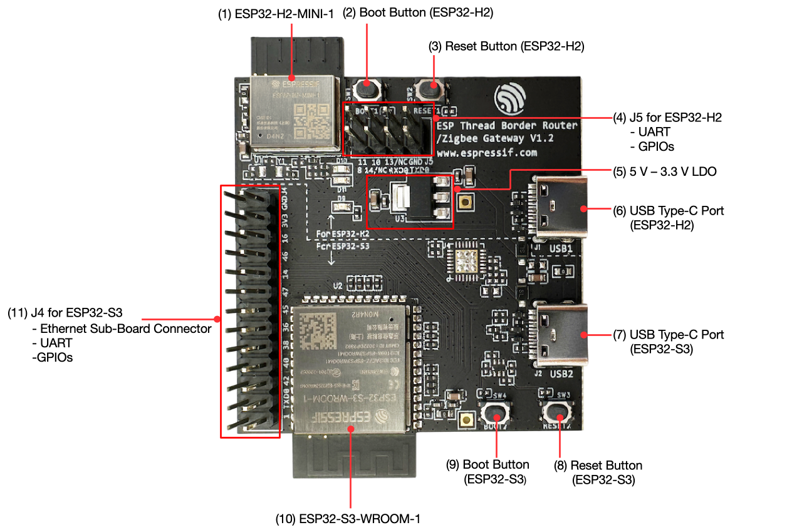
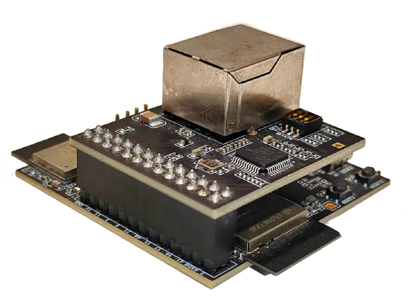

*********************
1. Hardware Platforms
*********************

This chapter describes the official Espressif hardware used with the ESP Thread Border Router SDK.

Espressif provides the **ESP Thread Border Router/Zigbee Gateway Board** and the optional **ESP Thread Border Router/Zigbee Gateway Sub-Ethernet** daughter board. The Border Router can use Wi-Fi or Ethernet as the backbone link.

This chapter consists of the following sections:

- :ref:`Board Overview <hw-board-overview>`: Identifies the components of both boards and lists their features
- :ref:`Hardware Reference <hw-hardware-reference>`: GPIO allocation, USB ports, buttons, DIP switch, and Ethernet interface
- :ref:`Ordering <hw-ordering>`: Ordering codes and purchase links
- :ref:`Related Documents <hw-related-documents>`: Schematics, CAD, and datasheets

For building firmware, forming a Thread network, and using SDK features, see :doc:`dev-guide/index`.

.. _hw-board-overview:

1.1. Board Overview
===================

The Espressif Thread Border Router supports Wi-Fi and Ethernet as backbone interfaces. A Wi-Fi-based ESP Thread Border Router consists of two SoCs:

- A host Wi-Fi SoC from the ESP32, ESP32-S, or ESP32-C series.
- An ESP32-H series SoC acting as the radio co-processor (RCP), which provides access to the IEEE 802.15.4 physical and MAC layers.

Espressif provides the following official hardware based on this architecture:

- **ESP Thread Border Router/Zigbee Gateway Board**: The main board integrates an ESP32-S3 host SoC and an ESP32-H2 RCP. It uses the ESP32-S3 Wi-Fi interface as the backbone interface.
- **ESP Thread Border Router/Zigbee Gateway Sub-Ethernet**: The optional daughter board connects to the main board and extends it with an Ethernet interface. It cannot operate independently. An Ethernet-based Thread Border Router therefore requires both the main board and the daughter board.

1.1.1. Feature List
-------------------

The main features of the boards are listed below.

Main board (ESP Thread Border Router/Zigbee Gateway Board):

- **Modules Embedded:** ESP32-S3-WROOM-1 (8 MB flash, 2 MB PSRAM) host and ESP32-H2-MINI-1 RCP
- **Host/RCP Communication:** UART (default, 460800 baud)
- **RCP Control:** Dedicated reset and boot GPIOs from the host for automatic RCP firmware update
- **RF Coexistence:** 4-wire PTA signaling between the ESP32-S3 (Wi-Fi) and the ESP32-H2 (802.15.4)
- **USB:** 2 x USB Type-C, one wired to each SoC's built-in USB-Serial-JTAG; either port can power the board
- **Buttons:** Independent Boot and Reset buttons for the ESP32-S3 and for the ESP32-H2
- **Expansion:** 2x4 header (J5) for the ESP32-H2, and 2x13 header (J4) for the ESP32-S3 that also serves as the Sub-Ethernet connector
- **Power Supply:** 5 V from either USB Type-C port; on-board 5 V-to-3.3 V LDO

Sub-Ethernet daughter board (ESP Thread Border Router/Zigbee Gateway Sub-Ethernet):

- **Ethernet Controller:** W5500, with integrated 10/100 Mbps MAC and PHY
- **Host Interface:** SPI, plus interrupt and reset lines
- **Ethernet Speed:** 10/100 Mbps, half or full duplex
- **Ethernet Connector:** Shielded RJ45 with integrated magnetics and status LEDs
- **DIP Switch:** 3-position PMODE switch that selects the W5500 link mode (default: auto-negotiation)
- **Board-to-board Connector:** 2x13 connector (J2) that mates with J4 on the main board

.. _hw-description-of-components:

1.1.2. Description of Components
--------------------------------

The key components of each board are described below.

Main Board
^^^^^^^^^^

   ESP Thread Border Router/Zigbee Gateway Board - front (click to enlarge)

The key components of the main board are described in a clockwise direction.

.. list-table::
   :widths: 8 40 67
   :header-rows: 1

   * - No.
     - Key Component
     - Description
   * - 1
     - ESP32-H2-MINI-1
     - 802.15.4 RCP module. Provides the Thread/Zigbee radio (IEEE 802.15.4 PHY and MAC) for the Border Router.
   * - 2
     - Boot Button (ESP32-H2)
     - Holds the ESP32-H2 in download mode. See :ref:`Boot and Reset Buttons <hw-boot-reset-buttons>`.
   * - 3
     - Reset Button (ESP32-H2)
     - Resets the ESP32-H2. See :ref:`Boot and Reset Buttons <hw-boot-reset-buttons>`.
   * - 4
     - J5 for ESP32-H2
     - 2x4 pin header exposing the ESP32-H2 UART0 and several GPIOs. See :ref:`GPIO Allocation <hw-gpio-allocation>`.
   * - 5
     - 5 V – 3.3 V LDO
     - Regulates the 5 V USB input down to the 3.3 V rail shared by both SoCs and the daughter board.
   * - 6
     - USB Type-C Port (ESP32-H2)
     - Referred to as **USB1**. Connected to the ESP32-H2 built-in USB-Serial-JTAG. Flashes and monitors the RCP directly, and can power the board. See :ref:`USB Ports <hw-usb-ports>`.
   * - 7
     - USB Type-C Port (ESP32-S3)
     - Referred to as **USB2**. Connected to the ESP32-S3 built-in USB-Serial-JTAG. Flashes and monitors the host application, and can power the board. This is the port used in normal development. See :ref:`USB Ports <hw-usb-ports>`.
   * - 8
     - Reset Button (ESP32-S3)
     - Resets the ESP32-S3. See :ref:`Boot and Reset Buttons <hw-boot-reset-buttons>`.
   * - 9
     - Boot Button (ESP32-S3)
     - Holds the ESP32-S3 in download mode. See :ref:`Boot and Reset Buttons <hw-boot-reset-buttons>`.
   * - 10
     - ESP32-S3-WROOM-1
     - Host Wi-Fi module. 8 MB flash and 2 MB PSRAM. Runs the ESP Thread Border Router application.
   * - 11
     - J4 for ESP32-S3
     - 2x13 pin header exposing the ESP32-S3 UART0 and GPIOs. Also the board-to-board connector that the Sub-Ethernet daughter board plugs into. See :ref:`GPIO Allocation <hw-gpio-allocation>`.

Sub-Ethernet Daughter Board
^^^^^^^^^^^^^^^^^^^^^^^^^^^^

.. list-table::
   :widths: 50 50
   :class: borderless

   * - .. figure:: ../images/esp-thread-border-router-sub-ethernet-front.webp
          :align: center
          :width: 90%
          :alt: ESP Thread Border Router/Zigbee Gateway Sub-Ethernet - front (click to enlarge)

          ESP Thread Border Router/Zigbee Gateway Sub-Ethernet - front (click to enlarge)

     - .. figure:: ../images/esp-thread-border-router-sub-ethernet-back.webp
          :align: center
          :width: 100%
          :alt: ESP Thread Border Router/Zigbee Gateway Sub-Ethernet - back (click to enlarge)

          ESP Thread Border Router/Zigbee Gateway Sub-Ethernet - back (click to enlarge)

The key components on the front and back of the board are described below.

.. list-table::
   :widths: 8 30 62
   :header-rows: 1

   * - No.
     - Key Component
     - Description
   * - 1
     - J1-RJ45
     - Shielded RJ45 jack with integrated magnetics and link/activity/speed LEDs. See :ref:`Ethernet Interface <hw-ethernet-interface>`.
   * - 2
     - PMODE Switch
     - 3-position DIP switch that selects the W5500 link speed, duplex, and auto-negotiation mode. See :ref:`Sub-Ethernet DIP Switch <hw-daughter-board-dip-switches>`.
   * - 3
     - W5500
     - Wiznet Ethernet controller with an integrated 10/100 Mbps MAC and PHY. Connects to the ESP32-S3 host over SPI. See :ref:`Ethernet Interface <hw-ethernet-interface>`.
   * - 4
     - J2
     - 2x13 board-to-board connector on the underside of the board. Mates with J4 on the main board and carries the SPI, interrupt, and reset signals. See :ref:`GPIO Allocation <hw-gpio-allocation>`.

Main Board and Daughter Board Connection
^^^^^^^^^^^^^^^^^^^^^^^^^^^^^^^^^^^^^^^^^

The Sub-Ethernet daughter board mounts on top of the main board. Its J2 connector, on the underside of the daughter board, plugs into the J4 connector of the main board, as shown below.

   Connecting the Sub-Ethernet daughter board to the main board (click to enlarge)

When connecting the boards:

- Disconnect both USB cables so that the boards are unpowered.
- Align the J2 and J4 connectors, then press the boards together evenly until the connector is fully seated.
- The daughter board draws its 3.3 V supply from the main board through J4/J2. It cannot operate on its own.

1.1.3. Default Firmware
-----------------------

Each board is shipped with the pre-built ``basic_thread_border_router`` example firmware, so you can evaluate the Border Router without building the SDK first.

To power up the board and verify the firmware, follow :doc:`codelab/index`, starting with the hardware and network setup. To rebuild or update the firmware, see :doc:`dev-guide/build_and_run`.

.. _hw-hardware-reference:

1.2. Hardware Reference
=======================

This section provides more detailed information about the board's hardware.

.. _hw-gpio-allocation:

1.2.1. GPIO Allocation
----------------------

The tables below provide the allocation of GPIOs on the host (ESP32-S3-WROOM-1) and RCP (ESP32-H2-MINI-1) modules, and the GPIOs used for the Sub-Ethernet daughter board.

Host-to-RCP GPIO Allocation
^^^^^^^^^^^^^^^^^^^^^^^^^^^^

The host and the RCP are connected by the following signals, grouped by purpose:

- **UART, RESET, BOOT** (mandatory): the host-to-RCP communication interface, plus the reset and boot lines the host uses to reflash the RCP. The default UART baud rate is 460800.
- **PTA coexistence wires** (optional): RF coexistence signaling between the ESP32-S3 (Wi-Fi) and the ESP32-H2 (802.15.4), disabled by default and enabled with ``EXTERNAL_COEX_ENABLE``.

.. list-table:: Host (ESP32-S3) to RCP (ESP32-H2) GPIO Allocation
   :header-rows: 1
   :widths: 16 15 17 52

   * - Function
     - ESP32-S3 GPIO
     - ESP32-H2 GPIO
     - Note
   * - UART TX
     - GPIO18
     - GPIO23 (U0RXD)
     - Mandatory. ESP32-S3 TX to ESP32-H2 RX. RCP communication interface.
   * - UART RX
     - GPIO17
     - GPIO24 (U0TXD)
     - Mandatory. ESP32-S3 RX from ESP32-H2 TX. RCP communication interface.
   * - RCP RESET
     - GPIO7
     - EN
     - Mandatory. Host resets the RCP. Used for automatic RCP update.
   * - RCP BOOT
     - GPIO8
     - GPIO9
     - Mandatory. Host holds the RCP in download mode. Used for automatic RCP update.
   * - Coex request
     - GPIO12
     - GPIO0
     - Optional. RF coexistence, disabled by default.
   * - Coex priority
     - GPIO10
     - GPIO2
     - Optional. RF coexistence, disabled by default.
   * - Coex grant
     - GPIO13
     - GPIO1
     - Optional. RF coexistence, disabled by default.
   * - Coex tx_line
     - GPIO11
     - GPIO3
     - Optional. Fourth coexistence wire, required only with an ESP32-S3 host. Newer Wi-Fi SoCs (ESP32-C6, ESP32-S31, and so on) need only the 3 wires above.

.. note::

   The RCP interface pins can be changed through menuconfig at ``ESP Thread Border Router Example`` → ``Board Configuration``. The RCP target (ESP32-H2 or ESP32-C6) is selected at ``ESP Thread Border Router Example`` → ``Border router RCP target``.

Host-to-Sub-Ethernet GPIO Allocation
^^^^^^^^^^^^^^^^^^^^^^^^^^^^^^^^^^^^^

The following GPIOs are used by the ``basic_thread_border_router`` example when the Sub-Ethernet daughter board is attached. The signals are routed through the J4 (main board) and J2 (daughter board) connectors.

.. list-table:: Host (ESP32-S3) to Sub-Ethernet GPIO Allocation
   :header-rows: 1
   :widths: 25 20 20 35

   * - Function
     - ESP32-S3 GPIO
     - Direction
     - Note
   * - SPI SCLK
     - GPIO21
     - Output
     - SPI2. 33 Ω series resistor for EMI reduction.
   * - SPI MOSI
     - GPIO45
     - Output
     - 33 Ω series resistor for EMI reduction.
   * - SPI MISO
     - GPIO38
     - Input
     -
   * - SPI CS
     - GPIO41
     - Output
     -
   * - SPI interrupt
     - GPIO39
     - Input
     -
   * - PHY reset
     - GPIO40
     - Output
     -

These pins can be changed through menuconfig at ``ESP Thread Border Router Example`` → ``Ethernet``.

.. _hw-usb-ports:

1.2.2. USB Ports
----------------

The main board has two USB Type-C ports, one wired to each SoC. Both ports connect directly to the built-in USB-Serial-JTAG controller of the respective SoC. No USB-to-UART bridge chip is populated, so each port enumerates as a single USB-Serial-JTAG device (for example ``/dev/ttyACMx`` on Linux), not as a ``/dev/ttyUSBx`` UART device.

.. list-table::
   :header-rows: 1
   :widths: 12 18 70

   * - Port
     - Connected SoC
     - Purpose
   * - USB1
     - ESP32-H2 (RCP)
     - Flashing and monitoring the ESP32-H2 directly, for example when building the ``ot_rcp`` firmware manually. Also supplies board power. Not required for normal Border Router operation or for automatic RCP update.
   * - USB2
     - ESP32-S3 (host)
     - Flashing and monitoring the host application (the ``basic_thread_border_router`` example). Also supplies board power. This is the port used in normal development.

Both ports feed a common 5 V rail through Schottky diodes, so the board can be powered from either port, and connecting both at the same time is safe. For a Wi-Fi-based Border Router, only USB2 needs to be connected.

.. _hw-boot-reset-buttons:

1.2.3. Boot and Reset Buttons
-----------------------------

The main board has two independent button pairs, one for each SoC.

.. list-table::
   :header-rows: 1
   :widths: 22 20 58

   * - Button
     - Target SoC
     - Function
   * - Reset (ESP32-S3)
     - ESP32-S3 (host)
     - Resets the ESP32-S3.
   * - Boot (ESP32-S3)
     - ESP32-S3 (host)
     - Pulls ESP32-S3 GPIO0 low. Hold it while pressing Reset to enter download mode.
   * - Reset (ESP32-H2)
     - ESP32-H2 (RCP)
     - Resets the ESP32-H2.
   * - Boot (ESP32-H2)
     - ESP32-H2 (RCP)
     - Pulls ESP32-H2 GPIO9 low. Hold it while pressing Reset to enter download mode.

To put a SoC into download mode manually, hold its Boot button, press and release its Reset button, then release its Boot button.

In normal use you rarely need these buttons:

- The USB-Serial-JTAG interface of each SoC supports automatic download, so ``idf.py flash`` does not require pressing Boot and Reset.
- When ``AUTO_UPDATE_RCP`` is enabled (the default in the ``basic_thread_border_router`` example), the host drives the RCP reset line (ESP32-S3 GPIO7) and boot line (ESP32-S3 GPIO8) electrically to reflash the ESP32-H2 automatically on an RCP version mismatch. See :doc:`dev-guide/rcp_update`.

.. _hw-daughter-board-dip-switches:

1.2.4. Sub-Ethernet DIP Switch
------------------------------

The Sub-Ethernet daughter board has a 3-position DIP switch (labeled PMODE) that drives the ``PMODE[2:0]`` pins of the W5500 and selects the Ethernet link mode. Each line has a pull-up, so an open (OFF) switch reads as ``1`` and a closed (ON) switch reads as ``0``.

.. list-table:: PMODE DIP Switch
   :header-rows: 1
   :widths: 15 20 20 20

   * - Switch
     - W5500 signal
     - OFF (default)
     - ON
   * - 1
     - PMODE2
     - 1
     - 0
   * - 2
     - PMODE1
     - 1
     - 0
   * - 3
     - PMODE0
     - 1
     - 0

The resulting ``PMODE[2:0]`` value selects the following link modes:

.. list-table::
   :header-rows: 1
   :widths: 20 80

   * - PMODE[2:0]
     - Link mode
   * - 000
     - 10BASE-T half-duplex, auto-negotiation disabled
   * - 001
     - 10BASE-T full-duplex, auto-negotiation disabled
   * - 010
     - 100BASE-TX half-duplex, auto-negotiation disabled
   * - 011
     - 100BASE-TX full-duplex, auto-negotiation disabled
   * - 100
     - 100BASE-TX half-duplex, auto-negotiation enabled
   * - 111
     - All capable, auto-negotiation enabled

.. note::

   The board ships with all three switches in the **OFF** position, which gives ``PMODE[2:0] = 111`` (auto-negotiation, all speeds and duplex modes). This is the recommended setting for using the board as an Ethernet Border Router. Change it only if you need to force a fixed speed or duplex mode.

.. _hw-ethernet-interface:

1.2.5. Ethernet Interface
-------------------------

The Sub-Ethernet daughter board uses a W5500 Ethernet controller that integrates the MAC and the 10/100 Mbps PHY. It connects to the ESP32-S3 host over SPI. The magnetics are integrated in the RJ45 jack.

.. list-table::
   :header-rows: 1
   :widths: 30 25 45

   * - Parameter
     - Value
     - Note
   * - Ethernet controller
     - W5500
     - Integrated 10/100 Mbps MAC and PHY
   * - Host interface
     - SPI
     - Connected to the ESP32-S3 host, plus interrupt and reset lines
   * - SPI host
     - SPI2
     - Configurable in menuconfig
   * - SPI clock speed
     - 36 MHz
     - Configurable in menuconfig
   * - PHY address
     - 1
     - Configurable in menuconfig
   * - Reference clock
     - 25 MHz crystal
     - On the daughter board
   * - Link speed
     - 10/100 Mbps, half or full duplex
     - Selected by the PMODE DIP switch. See :ref:`Sub-Ethernet DIP Switch <hw-daughter-board-dip-switches>`.
   * - Connector
     - Shielded RJ45 with integrated magnetics
     - With link/activity and speed/duplex LEDs

.. _hw-ordering:

1.3. Ordering
=============

The available ordering codes for the main board and the Sub-Ethernet daughter board are listed below.

.. list-table::
   :header-rows: 1
   :widths: 31 30 7 7 25

   * - Ordering Code
     - On-board Module
     - Flash [#]_
     - PSRAM
     - Description

   * - ESP Thread BR-Zigbee GW
     - ESP32-S3-WROOM-1 and ESP32-H2-MINI-1
     - 8 MB [#]_
     - 2 MB
     - ESP Thread Border Router/Zigbee Gateway Board
   * - ESP Thread BR-Zigbee GW_SUB
     -
     -
     -
     - ESP Thread Border Router/Zigbee Gateway Sub-Ethernet

.. [#] The flash is integrated in the chip's package.
.. [#] It was 4 MB in some early samples.

For retail orders, please go to https://www.espressif.com/en/company/contact/buy-a-sample.

For wholesale orders, please go to https://www.espressif.com/en/contact-us/sales-questions.

.. _hw-related-documents:

1.4. Related Documents
======================

- Schematic

  - `ESP Thread Border Router/Zigbee Gateway Board schematic <https://dl.espressif.com/dl/schematics/esp_thread_br_zigbee_gw_schematics_v1.3.pdf>`_ (PDF)
  - `ESP Thread Border Router/Zigbee Gateway Sub-Ethernet schematic <https://dl.espressif.com/dl/schematics/esp_thread_br_zigbee_gw_sub_ethernet_schematiccs_v1.0.pdf>`_ (PDF)

- CAD

  - `ESP Thread Border Router/Zigbee Gateway Board CAD <https://dl.espressif.com/dl/schematics/ESP-Thread%20BR&Zigbee%20GW_V1.zip>`_ (ZIP)
  - `ESP Thread Border Router/Zigbee Gateway Sub-Ethernet CAD <https://dl.espressif.com/dl/schematics/ESP-Thread%20BR&Zigbee%20GW_Sub_Ethernet_V1.zip>`_ (ZIP)

- Datasheet

  - `ESP32-S3 Datasheet <https://www.espressif.com/sites/default/files/documentation/esp32-s3_datasheet_en.pdf>`_ (PDF)
  - `ESP32-H2 Datasheet <https://www.espressif.com/sites/default/files/documentation/esp32-h2_datasheet_en.pdf>`_ (PDF)
  - `ESP32-S3-WROOM-1 & ESP32-S3-WROOM-1U Datasheet <https://www.espressif.com/sites/default/files/documentation/esp32-s3-wroom-1_wroom-1u_datasheet_en.pdf>`_ (PDF)
  - `ESP32-H2-MINI-1 & ESP32-H2-MINI-1U Datasheet <https://www.espressif.com/sites/default/files/documentation/esp32-h2-mini-1_mini-1u_datasheet_en.pdf>`_ (PDF)

For further design documentation for the board, please contact us at `sales@espressif.com <sales@espressif.com>`_.
