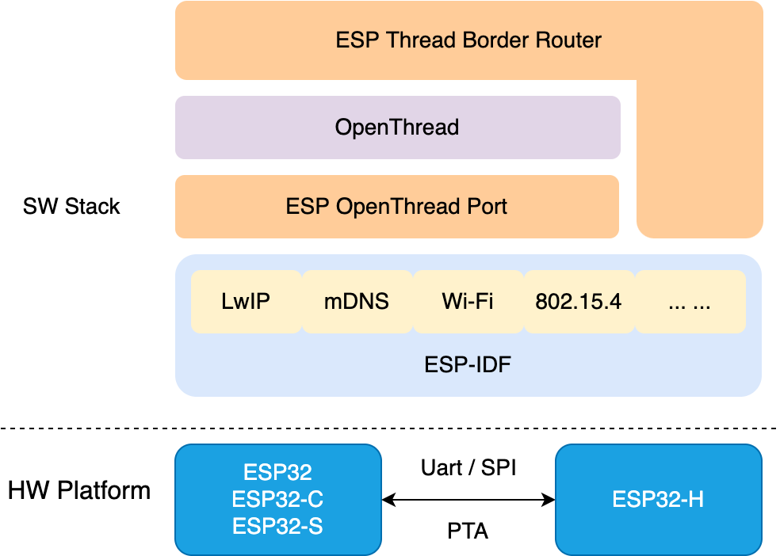

ESP Thread Border Router SDK
============================

Espressif Thread Border Router solution is based on the combination of Espressif's Wi-Fi and 802.15.4 SoCs, built on the `ESP-IDF <https://github.com/espressif/esp-idf>`_ and open-source `OpenThread <https://github.com/openthread/openthread>`_ stack.

   ESP-Thread-Border-Router Software Components

This solution has obtained the Thread 1.3 `Certified Component Certificate <https://www.espressif.com/sites/default/files/Espressif%20Thread%20Border%20Router%20Thread%20V1.3%20Interoperability%20Certification.pdf>`_ issued by the Thread Group, complying with the latest Thread 1.3 standard, and supporting Matter application scenario.

It provides the following features:

  - Bi-directional IPv6 Connectivity
  - Service Discovery
  - Multicast Forwarding
  - NAT64
  - Credential Sharing
  - TREL
  - RCP update
  - RF coexistence
  - Web GUI
  - ...

Table of Contents
=================

.. toctree::
   :maxdepth: 2

   hardware_platforms
   dev-guide/index
   codelab/index
   api-reference/index
   qa
