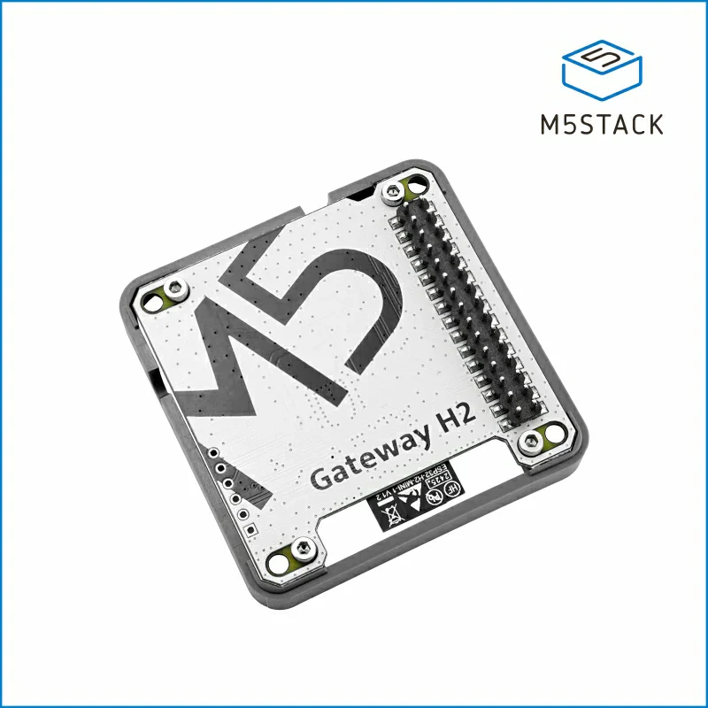
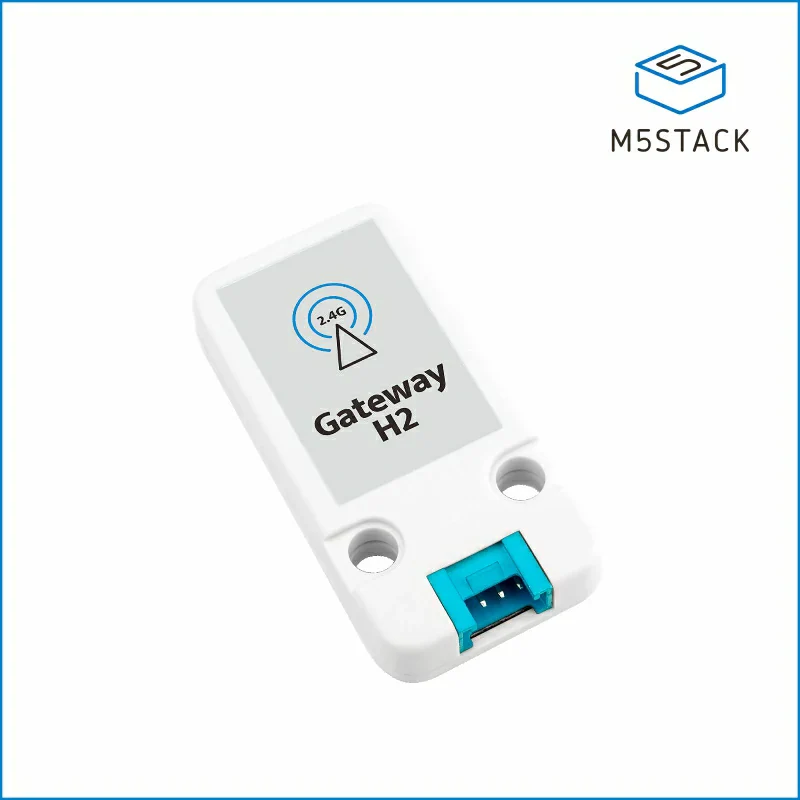

# OpenThread Border Router M5Stack Example

## Overview

This example is based on the M5Stack CoreS3 and leverages its touchscreen to demonstrate the Credential Sharing feature in Thread 1.4 release, in addition to basic Thread BR functionality.

The ePSKc can be generated via the touchscreen and is used to establish a DTLS session with a Thread Commissioner. Thread credentials can then be retrieved or configured through the secure session.

## How to Use the Example

### Hardware Required

This example requires the M5Stack CoreS3 along with the ESP32-H2 Thread/Zigbee Gateway Module. Please refer to:

- [M5Stack CoreS3](https://shop.m5stack.com/products/m5stack-cores3-esp32s3-lotdevelopment-kit)

<p align="center">
  
</p>

- [ESP32-H2 Thread/Zigbee Gateway Module](https://shop.m5stack.com/products/esp32-h2-thread-zigbee-gateway-module)

<p align="center">
  
</p>

### IDF Version Required

This example requires [IDF v5.5.1](https://github.com/espressif/esp-idf/tree/v5.5.1). It may not be compatible with older or newer versions of IDF.

### Configure the Project

ESP32-S3 is the SoC on M5Stack CoreS3, so set target to esp32s3:

```sh
idf.py set-target esp32s3
```

The example is pre-configured via `sdkconfig.defaults`, and most configurations do not need to be modified using `idf.py menuconfig`. You can modify the following parameters as needed:

1. Initial OpenThread dataset, such as the `networkkey` and `channel`.
2. Lifetime and port of the Ephemeral Key, which can be configured via `menuconfig -> ESP Thread Border Router M5Stack Example`.

### Create the RCP Firmware Image

First build the [ot_rcp](https://github.com/espressif/esp-idf/tree/master/examples/openthread/ot_rcp) example in IDF. In the building process, the built RCP image will be automatically packed into the Border Router firmware.

### Build, Flash, and Run

Build the project and flash it to the board, then run monitor tool to view serial output:

```
idf.py build

idf.py -p PORT erase-flash flash monitor
```

Follow the steps below to set up the Thread Border Router:

1. **First Boot**: On first boot, the device will start in SoftAP mode and provide a Wi-Fi configuration WEB service.

2. **Configure Wi-Fi**:
   - Join the SoftAP network (SSID: `ESP-ThreadBR-xxx`) from your phone or PC
   - Visit `http://192.168.4.1` to configure Wi-Fi SSID and password

3. **Connect and Form Network**: Once configured, the device will:
   - Connect to the configured Wi-Fi network
   - Form a Thread network
   - Act as a Thread Border Router

Once completed, the device will display the WEB server URL on its screen (see [ESP Thread BR WEB GUI](https://docs.espressif.com/projects/esp-thread-br/en/latest/codelab/web-gui.html)).

The `Share Thread Network Credential` button is used to generate an OpenThread ephemeral key and advertise the `meshcop-e` service on the Wi-Fi network. This ephemeral key enables the Thread Commissioner to establish a secure session with the Thread Border Router, allowing the Commissioner to retrieve or configure the network credential on the Border Router.

For more usage instructions and Thread Border Router features, refer to [ESP Thread BR CodeLab](https://docs.espressif.com/projects/esp-thread-br/en/latest/codelab/index.html).

### Adapting to Unit Gateway H2

The above configuration process is intended for use with the [Module Gateway H2](https://docs.m5stack.com/en/module/Module%20Gateway%20H2). If you are using the [Unit Gateway H2](https://docs.m5stack.com/en/unit/Unit%20Gateway%20H2):

<p align="center">
  
</p>

Please follow the steps below:

1. Hardware Setup: Prepare a Unit Gateway H2 flashed with `ot_rcp` and connect it to the M5Stack via `PORT.C`.
2. Build Configuration:
   - Enable the `RADIO_CO_PROCESSOR_UNIT_H2` feature via menuconfig.
   - Disable the `AUTO_UPDATE_RCP` feature via menuconfig.
   - Set `PIN_TO_RCP_TX` to `18` and `PIN_TO_RCP_RX` to `17` via menuconfig.

After that, build and flash as usual. The example will then operate using the Unit Gateway H2.
